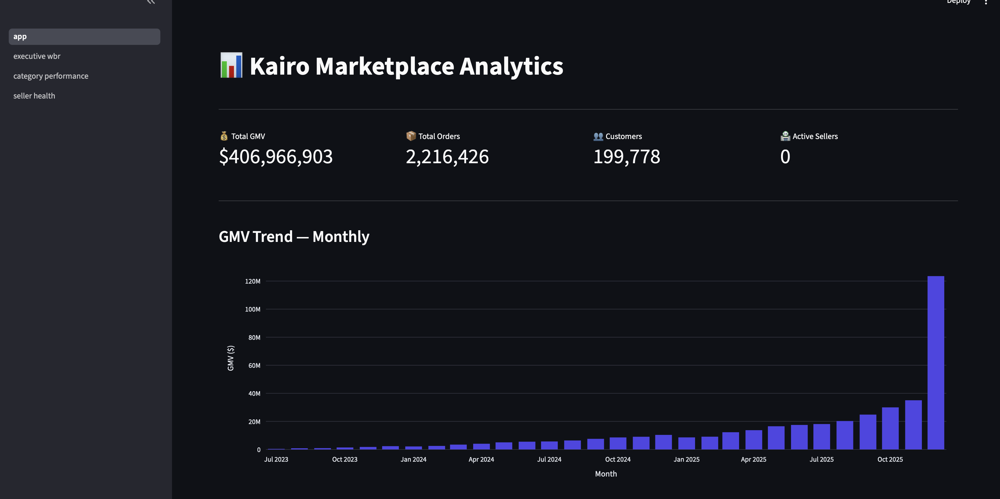
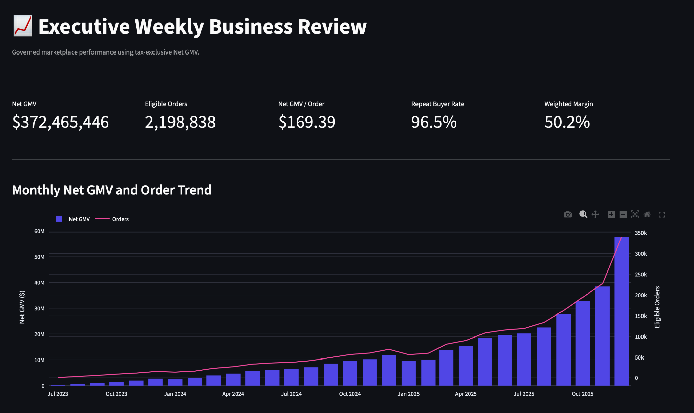
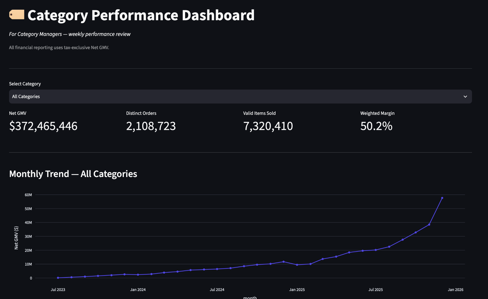
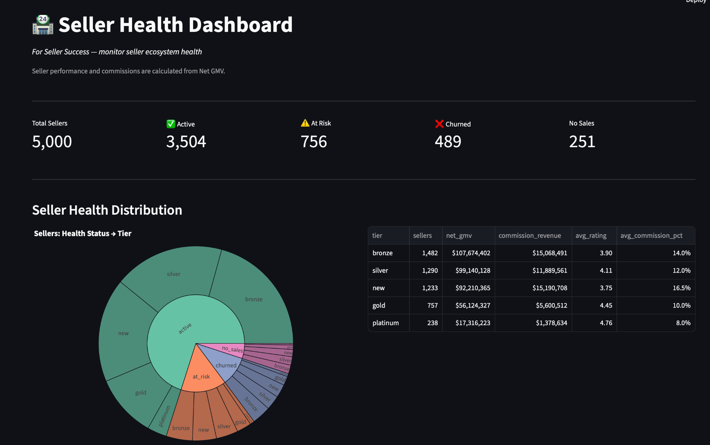

# 📊 Kairo Marketplace Analytics Platform

An end-to-end Business Intelligence Engineering project that simulates a mid-sized global e-commerce marketplace — from synthetic data generation through production-grade data quality issues, a medallion architecture cleaning pipeline, and interactive executive dashboards.

**Built to demonstrate the full BIE workflow as practiced at companies like Amazon.**

---

## 🎯 What This Project Demonstrates

- **Synthetic data generation** — 15M+ realistic e-commerce records across 9 interconnected tables
- **Production data quality simulation** — 3.8M chaos events injected (duplicates, null variants, type drift, orphan FKs, business logic violations)
- **Medallion architecture** — Bronze → Silver → Gold transformation pipeline in dbt
- **Data cleaning at scale** — deduplication, null standardization, type casting, zombie filtering, orphan removal
- **Star schema modeling** — 4 dimensions, 2 facts, 3 business marts
- **107 automated tests** — uniqueness, referential integrity, accepted values, custom SQL business rules
- **Interactive dashboards** — 4 Streamlit pages serving different stakeholder personas

---

## 📸 Dashboard Screenshots

### Home — Executive KPIs


### Executive Weekly Business Review


### Category Performance


### Seller Health


---

## 🏗️ Architecture

Python Generators (Faker + Pydantic + Polars)
→ 200K customers, 5K sellers, 50K products
→ 2.9M orders, 6.8M items, 3M payments
→ 2.5M shipments, 589K returns, 731K reviews
↓
Chaos Engine (9 injector types)
→ 3.8M data quality issues injected
→ Ground truth preserved for accuracy scoring
↓
Bronze Layer (dbt — 9 views)
→ Raw messy data loaded via read_parquet()
↓
Silver Layer (dbt — 9 tables)
→ Deduplicated, null-standardized, type-cast
→ Zombies filtered, orphans removed, business logic flagged
↓
Gold Layer (dbt — 9 tables)
→ dim_customers, dim_sellers, dim_products, dim_dates
→ fact_orders, fact_order_items
→ mart_gmv_daily, mart_customer_ltv, mart_seller_health
↓
107 dbt Tests (99 pass, 8 documented warnings)
↓
Streamlit Dashboards (4 interactive pages)
→ Executive WBR, Category Performance, Seller Health

---

## 🛠️ Tech Stack

| Layer | Tools |
|-------|-------|
| Language | Python 3.11 |
| Data generation | Faker, Pydantic, Polars, NumPy |
| Storage | Parquet (Zstandard compression) |
| Warehouse | DuckDB |
| Transformation | dbt Core + dbt-duckdb |
| Testing | dbt tests (107 total) |
| Dashboards | Streamlit + Plotly |
| Version control | Git + GitHub |

---

## 📁 Project Structure

<pre>
kairo-marketplace-analytics/
├── generator/                    # Synthetic data generator
│   ├── entities/                 # Customer, Seller, Product, Order models
│   ├── engines/                  # Time, behavior engines (future)
│   ├── chaos/                    # 9 chaos injectors + config + engine
│   └── writers/                  # Parquet writer utilities
├── dbt_project/                  # dbt transformation pipeline
│   ├── models/
│   │   ├── bronze/               # 9 raw-load views
│   │   ├── silver/               # 9 cleaning models
│   │   └── gold/                 # 4 dims + 2 facts + 3 marts
│   ├── macros/                   # clean_numeric() helper
│   └── tests/                    # Custom SQL tests
├── analytics/
│   └── streamlit_app/            # 4-page dashboard suite
├── scripts/                      # Generation + profiling scripts
├── raw_data/                     # Generated messy Parquet (gitignored)
├── raw_data_clean/               # Ground truth backup (gitignored)
├── chaos_manifest/               # Change logs from chaos engine (gitignored)
├── warehouse/                    # DuckDB database (gitignored)
└── docs/                         # Business context + screenshots
</pre>
````

---

## 🚀 Quick Start

### Prerequisites
- Python 3.11+
- macOS / Linux

### Setup
```bash
git clone https://github.com/sriharichepuri21/kairo-marketplace-analytics.git
cd kairo-marketplace-analytics
uv venv
source .venv/bin/activate
uv pip install -e .
```

### Generate Data
```bash
python scripts/generate_customers.py
python scripts/generate_sellers.py
python scripts/generate_products.py
python scripts/generate_orders.py
python scripts/generate_payments.py
python scripts/generate_fulfillment.py
python scripts/apply_chaos.py
```

### Run dbt Pipeline
```bash
cd dbt_project
dbt run      # 27 models: Bronze → Silver → Gold
dbt test     # 107 tests
cd ..
```

### Launch Dashboards
```bash
streamlit run analytics/streamlit_app/app.py
```

---

## 📊 Key Metrics (from the data)

| Metric | Value |
|--------|-------|
| Total GMV | $407M |
| Total Orders | 4.07M |
| Avg Order Value | $99.95 |
| Repeat Customer Rate | 93.6% |
| Avg Gross Margin | 58.9% |
| On-Time Delivery | 92.1% |
| Return Rate | 12.0% |
| Review Rate (J-curve) | 15.1% |

---

## 🔬 Data Quality: Chaos Engine

The chaos engine injects 9 types of production-realistic data quality issues:

| Chaos Type | What It Simulates | Rows Affected |
|------------|-------------------|---------------|
| Near-duplicate records | Payment retries, CDC replays | ~435K |
| Null representation variants | "N/A", "", "NULL", "-", " " | ~1.5M values |
| Type drift (numbers as strings) | System migration artifacts | ~1.6M values |
| Encoding corruption | UTF-8/Latin-1 mismatches | Text columns |
| Late-arriving records | Network outages, batch delays | ~60K |
| Orphan foreign keys | Cleanup jobs, missed CDC events | ~175K |
| Business logic violations | Negative quantities, impossible discounts | ~195K |
| Zombie test data | QA records left in production | 50 records |
| Schema evolution | Added/renamed columns mid-stream | 4 changes |

Every change is logged to `chaos_manifest/` for ground truth comparison.

---

## 🧪 Testing

dbt test results:
PASS:  99
WARN:   8 (documented known issues)
ERROR:  0
Test categories:

Uniqueness on all primary keys
Not-null on required fields
Accepted values on categorical columns
Referential integrity (fact → dimension)
Custom SQL: no zombies in Silver, no orphans, GMV positive

---

## 📋 Business Context

This project simulates **Kairo**, a fictional mid-sized global e-commerce marketplace:

- **Scale:** 200K customers, 5K sellers, 50K products across US, EU, LATAM
- **Business model:** 12% commission on GMV + seller subscriptions
- **Strategic tension:** Growth decelerating from 45% to 30% YoY; investors want margin improvement

See [PROJECT_CHARTER.md](./PROJECT_CHARTER.md) for full business context, objectives, and stakeholder personas.

---

## 👤 About

Built by **Srihari Chepuri** as a portfolio project demonstrating end-to-end Business Intelligence Engineering capability.

- GitHub: [@sriharichepuri21](https://github.com/sriharichepuri21)

---

## 📄 License

This project is open source and available under the [MIT License](LICENSE).

