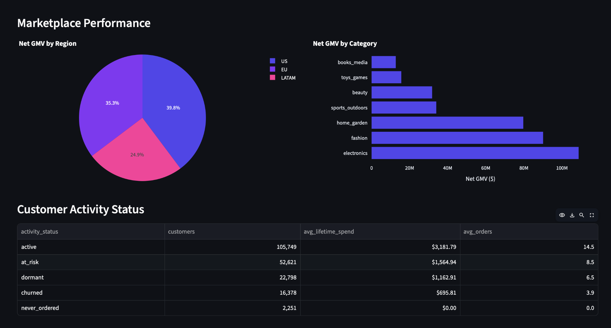
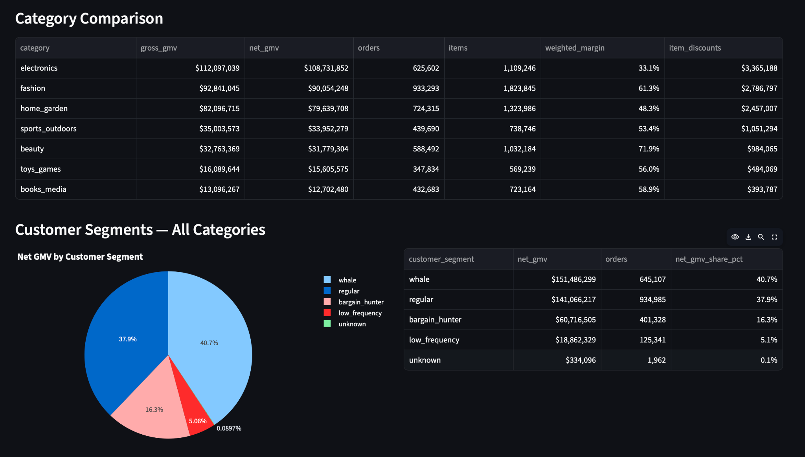
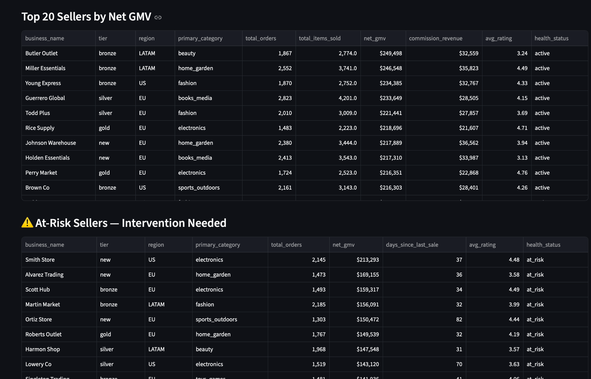

# 📊 Kairo Marketplace Business Intelligence Platform

An end-to-end Business Intelligence Engineering project that simulates a global e-commerce marketplace—from synthetic operational data generation and production-style data-quality failures to governed dimensional models, financial reconciliation, and interactive executive dashboards.

## 🎯 What This Project Demonstrates

- **Large-scale synthetic data generation** — 16M+ records across nine interconnected marketplace entities
- **Production-style data-quality simulation** — duplicates, null variants, type drift, schema evolution, late-arriving records, orphan keys, and business-rule violations
- **Medallion architecture** — Bronze, Silver, and Gold transformation layers built with dbt
- **Dimensional modeling** — four dimensions, two fact tables, and three analytical marts
- **Metric governance** — explicit Gross GMV, Net GMV, customer charged amount, and commission definitions
- **Financial reconciliation** — $0 cross-model variance across governed marketplace, seller, and customer measures
- **Automated testing** — 107 dbt data-quality tests with documented warnings for intentionally injected chaos
- **Stakeholder dashboards** — executive, category, regional, customer, and seller reporting in Streamlit

---

## 📸 Dashboard Screenshots

### Executive Overview


### Marketplace Performance and Customer Activity



### Executive Weekly Business Review


### Category Performance


### Category Comparison and Customer Segments



### Seller Health


### Seller Performance and At-Risk Intervention



---

## 🏗️ Architecture

```text
Python Generators — Faker, Pydantic, Polars
├── 200K customers
├── 5K sellers
├── 50K products
├── 2.87M orders
├── 6.83M order items
├── 2.99M payments
├── 2.50M shipments
├── 595K returns
└── 738K reviews
                  │
                  ▼
Chaos Engine — 9 production-style injectors
├── Duplicate and replayed records
├── Null representation variants
├── Type and schema drift
├── Late-arriving records
├── Orphan foreign keys
├── Business-rule violations
└── Zombie test data
                  │
                  ▼
Bronze Layer — 9 dbt views
└── Raw Parquet ingestion
                  │
                  ▼
Silver Layer — 9 dbt tables
├── Deduplication and null standardization
├── Type casting and schema normalization
├── Zombie-record filtering
├── Referential-integrity controls
└── Data-quality flags
                  │
                  ▼
Gold Layer — 9 dbt tables
├── dim_customers, dim_sellers, dim_products, dim_dates
├── fact_orders, fact_order_items
├── mart_gmv_daily
├── mart_customer_ltv
└── mart_seller_health
                  │
                  ▼
Governance, Testing, and Reconciliation
├── Gross and Net GMV validation
├── Unknown-customer member reconciliation
├── Customer-spend reconciliation
├── Seller-commission reconciliation
└── 107 automated dbt tests
                  │
                  ▼
Streamlit Business Intelligence Dashboards
├── Executive overview
├── Executive Weekly Business Review
├── Category performance
└── Seller health
```

---

## 🛠️ Tech Stack

| Layer | Tools |
|---|---|
| Language | Python 3.11 |
| Data generation | Faker, Pydantic, Polars, NumPy |
| Storage | Parquet with Zstandard compression |
| Warehouse | DuckDB |
| Transformation | dbt Core and dbt-duckdb |
| Modeling | Star schema, fact tables, dimensions, analytical marts |
| Testing | dbt generic tests and custom SQL tests |
| Dashboards | Streamlit and Plotly |
| Version control | Git and GitHub |

---

## 📁 Project Structure

```text
kairo-marketplace-analytics/
├── generator/
│   ├── entities/
│   ├── chaos/
│   └── writers/
├── dbt_project/
│   ├── models/
│   │   ├── bronze/
│   │   ├── silver/
│   │   └── gold/
│   ├── macros/
│   └── tests/
├── analytics/
│   └── streamlit_app/
├── scripts/
├── raw_data/
├── raw_data_clean/
├── chaos_manifest/
├── warehouse/
└── docs/
    └── screenshots/
```

---

## 🚀 Quick Start

### Prerequisites

- Python 3.11+
- macOS or Linux

### Setup

```bash
git clone https://github.com/sriharichepuri21/kairo-marketplace-analytics.git
cd kairo-marketplace-analytics
uv venv
source .venv/bin/activate
uv pip install -e .
```

### Generate Marketplace Data

```bash
python scripts/generate_customers.py
python scripts/generate_sellers.py
python scripts/generate_products.py
python scripts/generate_orders.py
python scripts/generate_payments.py
python scripts/generate_fulfillment.py
python scripts/apply_chaos.py
```

### Build and Test the Warehouse

```bash
cd dbt_project
dbt build
cd ..
```

Expected result:

```text
PASS=129 WARN=5 ERROR=0 SKIP=0 TOTAL=134
```

The successful nodes include 27 models and 102 passing tests. Five warnings represent intentionally injected null conditions.

### Verify Governed Metrics

```bash
python scripts/verify_metrics.py
python scripts/reconcile_metrics.py
python scripts/final_reconciliation.py
python scripts/marketing_channel_analysis.py
```

### Launch the Dashboards

```bash
streamlit run analytics/streamlit_app/app.py
```

---

## 📊 Governed Business Metrics

| Metric | Governed Value |
|---|---:|
| Gross GMV | $383,987,652.90 |
| Net GMV — primary GMV metric | $372,465,446.03 |
| Item discounts | $11,522,206.87 |
| Item tax | $37,247,710.32 |
| Customer charged amount | $457,134,465.37 |
| Real-customer lifetime spend | $456,728,338.76 |
| Orphan-order reconciliation spend | $406,126.61 |
| Commission revenue | $49,127,906.69 |
| Effective commission take rate | 13.19% |
| Eligible orders | 2,198,838 |
| Net GMV per eligible order | $169.39 |
| Real registered customers | 199,797 |
| Repeat-buyer rate among buyers | 96.5% |
| Weighted merchandise margin | 50.2% |
| On-time delivery rate | 92.1% |
| Return incidence | 12.1% |

### Seller Health

| Status | Sellers | Share |
|---|---:|---:|
| Active | 3,504 | 70.1% |
| At risk | 756 | 15.1% |
| Churned | 489 | 9.8% |
| No sales | 251 | 5.0% |
| **Total** | **5,000** | **100.0%** |

### Metric Definitions

**Gross GMV**  
Merchandise value before item discounts and tax.

**Net GMV**  
Gross GMV minus valid item discounts. Net GMV excludes tax and is the primary marketplace GMV metric.

**Customer charged amount**  
The sum of eligible `fact_orders.total_amount` values, used for customer-LTV and payment reconciliation.

**Commission revenue**  
Marketplace earnings calculated by applying each seller's commission rate to Net GMV.

`fact_order_items.line_total` is not used as GMV because it includes item-level tax.

---

## 📈 Business Intelligence Findings

- Referral customers generated **1.71× the average 90-day spend** of paid-search customers: **$725.54 versus $424.96**.
- Referral customers achieved a **79.0% 90-day repeat rate**, compared with **70.5%** for paid search—an **8.5-percentage-point difference**.
- Whale-persona customers represented **6.1% of real customers** and **40.2% of real-customer spend**.
- Electronics generated the largest category contribution with approximately **$108.7M in Net GMV**.
- The platform maintained a **92.1% on-time delivery rate**.
- Overall return incidence was **12.1%** across eligible sold items.
- Seller lifecycle modeling produced **756 at-risk**, **489 churned**, and **251 no-sales sellers** for intervention analysis.

Channel findings are associations partly created by intentional synthetic generator assumptions; they are not causal marketing conclusions.

---

## 🔬 Data Quality and Chaos Engineering

The chaos engine injects nine categories of production-style issues:

| Chaos Type | Example |
|---|---|
| Near-duplicate records | Payment retries and CDC replays |
| Null variants | `"N/A"`, `""`, `"NULL"`, and `"-"` |
| Type drift | Numeric values represented as strings |
| Encoding corruption | Character-set inconsistencies |
| Late-arriving records | Delayed events and batch outages |
| Orphan foreign keys | Deleted or missing dimension records |
| Business-rule violations | Negative quantities and impossible discounts |
| Zombie test data | QA records left in production |
| Schema evolution | Added or renamed source columns |

Every injected change is recorded in `chaos_manifest/` for audit and comparison.

---

## 🧪 Testing and Reconciliation

Current dbt validation:

```text
Models: 27
Tests: 107
Passing tests: 102
Documented warnings: 5
Errors: 0
```

Validation includes:

- Primary-key uniqueness
- Required-field checks
- Accepted categorical values
- Fact-to-dimension referential integrity
- Unknown-member customer reconciliation
- Orders occurring after customer signup
- Non-negative governed GMV
- Cross-model customer-spend reconciliation
- Cross-model seller and marketplace GMV reconciliation

All governed cross-model financial checks reconcile with **$0 variance**.

---

## 📋 Business Context

Kairo is a fictional global marketplace operating across the United States, European Union, and Latin America.

- **Scale:** 200K customers, 5K sellers, and 50K products
- **Revenue model:** Tiered seller commissions applied to Net GMV
- **Effective take rate:** 13.19%
- **Primary stakeholders:** Executives, category managers, seller-success teams, and analytics engineers

See [PROJECT_CHARTER.md](./PROJECT_CHARTER.md) for the complete business context and stakeholder definitions.

---

## 👤 About

Built by **Srihari Chepuri** as a portfolio project demonstrating end-to-end Business Intelligence Engineering, analytics engineering, dimensional modeling, metric governance, data-quality testing, and executive reporting.

- GitHub: [@sriharichepuri21](https://github.com/sriharichepuri21)

---

## 📄 License

This project is available under the [MIT License](LICENSE).
